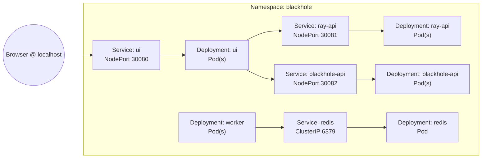

# Blackhole-Sim: Containers & Microservices Learning Lab

This project is a physics-themed sandbox for learning how microservices behave when you package them into containers and orchestrate them with two common tools:

- **Docker Compose** – fast local iteration on a single machine
- **Kubernetes (k3s)** – declarative orchestration with the same services

The code base stays identical; only the deployment descriptors change. That makes it ideal for DevOps engineers who want to compare how the same workload is wired together in Compose versus Kubernetes.

---

## System At A Glance

| Service | Tech | Role | API / Port |
| ------- | ---- | ---- | ---------- |
| `ray-api` | FastAPI | Integrates photon trajectories | `POST /integrate` on `8000` |
| `blackhole-api` | FastAPI | Calculates black hole derived values | `POST /derived` on `8001` |
| `worker` | Celery + Redis | Handles background jobs (not surfaced in UI yet) | connects to Redis |
| `redis` | Redis | Message broker + result store | `6379` |
| `ui-static` | Nginx serving `services/ui-static/index.html` | Browser UI that calls both APIs | `80` (Compose maps to `8080`) |

All services share the same physics library in `packages/core_physics/`.

---

## Repository Layout

```
blackhole-kubernettes/
├── README.md                    # You are here
├── infra/
│   ├── docker-compose.yml       # Compose topology
│   └── k8s/                     # Kubernetes manifests (kustomize base)
├── packages/core_physics/       # Reusable simulation library
├── services/
│   ├── blackhole-api/           # FastAPI microservice
│   ├── ray-api/                 # FastAPI microservice
│   ├── worker/                  # Celery worker
│   └── ui-static/               # Nginx + static UI
└── tools/, schemas/, etc.
```

---

## Running With Docker Compose (local iteration)

1. Build and start everything:
   ```bash
   docker compose -f infra/docker-compose.yml up --build
   ```
2. Open `http://localhost:8080`.
3. Press **Fire** – the UI calls `http://localhost:8000` (ray-api) and `http://localhost:8001` (blackhole-api).
4. Watch logs in your terminal or tail a specific service:
   ```bash
   docker compose -f infra/docker-compose.yml logs -f ray-api
   ```
5. Stop the stack when you are done:
   ```bash
   docker compose -f infra/docker-compose.yml down
   ```

### What to Observe
- **Networking is implicit.** Services discover each other by container name (`http://ray-api:8000` etc.).
- **Images are built in place.** Compose uses local build contexts; no registry push is required.
- **The UI auto-detects this mode.** When it sees the browser running on port `8080`, it calls the host-exposed API ports.

---

## Running On k3s (Kubernetes)

The manifests under `infra/k8s/` create the same services declaratively. Instead of an ingress controller we surface the containers through NodePort services so plain `http://localhost:<port>` works out of the box.

> **Note:** A default k3s install writes its kubeconfig to `/etc/rancher/k3s/k3s.yaml` with root-only permissions. Either run the commands below with `sudo`, or copy/adjust the kubeconfig so your user can read it:
> ```bash
> sudo cp /etc/rancher/k3s/k3s.yaml ~/.kube/config
> sudo chown $(id -u):$(id -g) ~/.kube/config
> export KUBECONFIG=~/.kube/config
> ```

### Images
Push the four service images to a registry reachable by k3s (example uses Docker Hub):
```bash
docker build -t marilee/blackhole-k8s:ui-dev -f services/ui-static/Dockerfile .
docker build -t marilee/blackhole-k8s:ray-api-dev -f services/ray-api/Dockerfile .
docker build -t marilee/blackhole-k8s:blackhole-api-dev -f services/blackhole-api/Dockerfile .
docker build -t marilee/blackhole-k8s:worker-dev -f services/worker/Dockerfile .

docker push marilee/blackhole-k8s:ui-dev
docker push marilee/blackhole-k8s:ray-api-dev
docker push marilee/blackhole-k8s:blackhole-api-dev
docker push marilee/blackhole-k8s:worker-dev
```

### Deploy
```bash
kubectl apply -k infra/k8s
kubectl get pods -n blackhole
kubectl get svc -n blackhole
```
Then browse to the NodePort endpoints:
- UI → `http://localhost:30080`
- ray-api → `http://localhost:30081`
- blackhole-api → `http://localhost:30082`

### Helpful Commands
```bash
kubectl logs -n blackhole -l app.kubernetes.io/name=ray-api --tail=0 -f
kubectl rollout restart deploy/ui -n blackhole
kubectl delete -k infra/k8s  # remove stack
```

### What to Observe
- **Networking is explicit.** Each public endpoint is a NodePort service; the cluster IPs stay internal, the node ports surface on `localhost`.
- **Image pulls are remote.** Deployments reference the pushed tags; `imagePullPolicy: Always` ensures fresh code on each rollout.
- **UI auto-detects this mode.** When it sees port `30080`, it calls the NodePort APIs on `30081/30082`.

### Kubernetes Resource Flow


### Kubectl Command Reference
Below is a field guide of the `kubectl` commands we used (and a few extras) with context-specific notes and sample outputs. All commands assume the resources live in the `blackhole` namespace established by the manifests.

**Inventory & Status**
```bash
kubectl get pods -n blackhole
```
_Output sample_
```
NAME                             READY   STATUS    RESTARTS   AGE
blackhole-api-74678bf757-6gfgl   1/1     Running   0          5m
ray-api-6896647c7c-597dh         1/1     Running   0          5m
redis-68657b4474-6gzwz           1/1     Running   0          5m
ui-d8d5dd8f7-pwb4m               1/1     Running   0          5m
worker-7fdcb9b789-kt626          1/1     Running   0          5m
```

```bash
kubectl get pods -n blackhole -o wide
```
_Shows pod IPs, nodes, and container images._
```
NAME                             READY   STATUS    RESTARTS   AGE   IP           NODE                    NOMINATED NODE   READINESS GATES
blackhole-api-74678bf757-6gfgl   1/1     Running   0          5m    10.42.0.9    mark-inspiron-14-5425   <none>           <none>
ray-api-6896647c7c-597dh         1/1     Running   0          5m    10.42.0.11   mark-inspiron-14-5425   <none>           <none>
...
```

```bash
kubectl get svc -n blackhole
```
_Verify NodePort allocations and cluster IPs._
```
NAME             TYPE       CLUSTER-IP     EXTERNAL-IP   PORT(S)           AGE
blackhole-api    NodePort   10.43.82.103   <none>        8001:30082/TCP    5m
ray-api          NodePort   10.43.6.177    <none>        8000:30081/TCP    5m
redis            ClusterIP  10.43.122.38   <none>        6379/TCP          5m
ui               NodePort   10.43.2.78     <none>        80:30080/TCP      5m
```

**Logs & Debugging**
```bash
kubectl logs deploy/ray-api -n blackhole --tail=20
```
_Fetch the latest requests handled by the ray tracer._
```
INFO:     10.42.0.12:49164 - \"POST /integrate HTTP/1.1\" 200 OK
```

```bash
kubectl logs -n blackhole -l app.kubernetes.io/name=ray-api --tail=0 -f
```
_Stream new log lines each time you press **Fire** in the UI (Ctrl+C to stop)._

```bash
kubectl describe pod ray-api-6896647c7c-597dh -n blackhole
```
_Detailed events, environment variables, and probe results for a specific pod._

**Rollouts & Scaling**
```bash
kubectl rollout status deploy/ui -n blackhole
```
_Wait for the UI deployment to become ready after a push._

```bash
kubectl rollout restart deploy/ui -n blackhole
```
_Forces Kubernetes to pull the latest `marilee/blackhole-k8s:ui-dev` tag._

```bash
kubectl scale deploy/ray-api --replicas=2 -n blackhole
```
_Spins up an extra API replica so you can watch request balancing._

**Port Forwarding & One-offs**
```bash
kubectl port-forward svc/ray-api 9000:8000 -n blackhole
```
_Expose the in-cluster API on `localhost:9000` without touching NodePorts._

```bash
kubectl get events -n blackhole --sort-by=.metadata.creationTimestamp
```
_View chronological events to debug probe failures or scheduling delays._

**Cleanup**
```bash
kubectl delete -k infra/k8s
```
_Removes the namespace, deployments, and services created by the manifests._

### Label Cheatsheet
We stick to a small set of labels so selectors stay readable:
- `app.kubernetes.io/name` – canonical service name; used by Services to discover Pods.
- `app.kubernetes.io/instance` – unique identifier for this workload (convenient when you run multiple stacks).
- `app.kubernetes.io/component` – aligns with the Kubernetes recommended labels and pairs with the Service selectors.
- `app.kubernetes.io/part-of` – indicates the broader application so you can query everything related to Blackhole.
- `tier` – human term for the role (`frontend`, `api`, `worker`, `datastore`).
- `system` – umbrella application (`blackhole`).

## Deploying with Helm

Helm gives you a packaged view of the same manifests so you can version experiments and roll physics tweaks out in a single command. The chart lives in `infra/helm` and currently deploys the UI.

### Install or upgrade
Make sure your `kubectl` context can read the k3s kubeconfig (see note above) or export `KUBECONFIG=~/.kube/config` before continuing.

If you previously applied the raw manifests (or any other tool) remove the `ui` resources so Helm can own them:

```bash
kubectl delete svc ui -n blackhole || true
kubectl delete deployment ui -n blackhole || true
```

Then install (or upgrade) the release:

```bash
helm upgrade --install blackhole infra/helm --namespace blackhole --create-namespace
```

Add `--set repository=<your-docker-username>/blackhole-k8s` if you push to a different registry. Drop the flag to use the default repository from `infra/helm/values.yaml`. After the rollout finishes, reuse the NodePort endpoints (`http://localhost:30080` for the UI).

### Preview manifests
Render without installing if you want to diff against the Kustomize output:

```bash
helm template blackhole infra/helm --namespace blackhole
```

A focused chart README lives at `infra/helm/README.md`.

### How Helm decides apply order
All templates in the chart are rendered into plain Kubernetes manifests before anything is created. Helm then sorts the manifests using a built-in install order (namespaces, CRDs, RBAC, services, deployments, etc.) and sends them to the API server one kind at a time. That ordering lives in Helm itself, so unlike `infra/k8s/kustomization.yaml` you do not have to list files manually—the chart simply declares the resources and Helm orchestrates their creation.

### Relationship to `infra/k8s`
The Helm chart under `infra/helm` is completely self-contained; it only renders the templates inside `infra/helm/templates`. Because that folder currently holds `deployment-ui.yaml` and `service-ui.yaml`, a Helm install creates **only** the UI Deployment and Service. Files such as `infra/k8s/worker.yaml` live in the Kustomize workflow and are ignored by Helm unless you port them into the chart. If you deleted `infra/k8s`, Helm installations would continue to work for the UI because they rely solely on the chart contents. The trade-off is scope: Kustomize deploys the full stack out of the box, while Helm starts with a minimal UI-focused chart that you can grow by adding more templates (e.g., copy `infra/k8s/worker.yaml` into `infra/helm/templates/worker.yaml` and parameterize it) as part of your learning journey.

### Kustomize ↔ Helm reference

| Piece | `infra/k8s` source | `infra/helm` equivalent | Notes |
| ----- | ------------------- | ----------------------- | ----- |
| Namespace | `namespace.yaml` | (none) | Helm relies on `helm upgrade --install ... --namespace blackhole --create-namespace`; each template embeds `metadata.namespace: blackhole` but the namespace object itself is not templated. |
| UI Deployment | `ui.yaml` (Deployment section) | `templates/deployment-ui.yaml` | Same core pod spec; Helm version drops the probes/labels for simplicity—add them if you want a 1:1 match. |
| UI Service | `ui.yaml` (Service section) | `templates/service-ui.yaml` | Both expose NodePort `30080`; Helm injects the image repo via `values.yaml`. |
| Ray API | `ray-api.yaml` | (not yet templated) | Add Deployment/Service templates to bring this workload under Helm. |
| Blackhole API | `blackhole-api.yaml` | (not yet templated) | Same approach as above when you are ready. |
| Worker | `worker.yaml` | (not yet templated) | Copy to Helm and parameterize environment variables or image tags as needed. |
| Redis | `redis.yaml` | (not yet templated) | Can stay in Kustomize or be moved into Helm when you want a single release. |
| Resource list | `kustomization.yaml` enumerates files | `Chart.yaml` + `values.yaml` define chart metadata & values | Helm discovers templates automatically; you manage configuration through `values.yaml` instead of listing every manifest manually. |

---

---
## Compose vs Kubernetes vs Helm

| Concern | Docker Compose | Kubernetes (k3s) | Helm (UI chart) | Takeaway |
| ------- | --------------- | ----------------- | --------------- | -------- |
| Orchestration files | `infra/docker-compose.yml` | `infra/k8s/*.yaml` + `kustomization.yaml` | `infra/helm/Chart.yaml`, `values.yaml`, `templates/*.yaml` | Compose is imperative YAML; Kustomize and Helm build declarative manifests with different packaging. |
| Scope | Full stack (UI, APIs, worker, Redis) | Full stack (same services) | UI Deployment + Service today | Helm chart starts minimal—extend it by templating more services. |
| Networking | Docker DNS (`http://ray-api:8000`) and host port `8080` for UI | NodePort Services (`30080/30081/30082`) | Same NodePort pattern, currently only `ui` on `30080` | Helm runs on Kubernetes, so networking behavior matches the underlying cluster. |
| Image distribution | Built locally with shared Docker daemon | Pull from registry / `k3s ctr images import` | Same registry flow, repository overridden via `--set repository=...` | Helm rides on top of Kubernetes image pulls. |
| Scaling | `docker compose up --scale service=2` | `kubectl scale deploy/<svc>` | Edit template / add values then `helm upgrade` | Helm captures desired replicas in chart values, aligning with Kubernetes desired state. |
| Config updates | `docker compose up --build` | `kubectl apply` + rollout commands | `helm upgrade --install ... [--set ...]` | Helm bundles manifests + configuration for versioned rollouts. |
| Logs & debugging | `docker compose logs` | `kubectl logs`, `kubectl describe` | Same `kubectl` commands (Helm just labeled resources with release info) | Tooling converges once workloads run in Kubernetes. |
| UI routing | Browser → `localhost:8080` (Compose) | Browser → `localhost:30080` (NodePort) | Browser → `localhost:30080` (NodePort) | Application detects environment; routing differs between Compose vs Kubernetes. |

Both environments share the same code, Dockerfiles, and environment variables. The only difference is how endpoints are exposed and how images reach the runtime.

---

## Learning Checklist

1. **Trace a request** – When you press **Fire**, follow the call in both environments:
   - UI → `blackhole-api` `/derived`
   - UI → `ray-api` `/integrate`
   - UI renders trajectory

2. **Inspect logs** – Compose vs Kubernetes commands above.

3. **Modify the physics** – Change `packages/core_physics/core_physics/integrators.py`, rebuild images, and redeploy in both setups to observe the update flow.

4. **Scale a service** – Try `docker compose up --scale ray-api=2` vs `kubectl scale deploy/ray-api --replicas=2 -n blackhole` and watch how each platform balances requests.

---

## Troubleshooting Cheatsheet

| Symptom | Likely Cause | Fix |
| ------- | ------------ | --- |
| UI shows `NetworkError` in Compose | APIs not reachable on host ports | Ensure Compose stack is up; check `docker compose ps`. |
| UI shows `NetworkError` on k3s | NodePort services not reachable or images stale | Reapply manifests, ensure images are pushed, and confirm ports 30080-30082 are open. |
| Pods stay in `ImagePullBackOff` | Registry not accessible or tag missing | Push images to the configured registry or preload them: `k3s ctr images import`. |

---

## Cleaning Up

- **Stop Compose stack**: `docker compose -f infra/docker-compose.yml down`
- **Remove Kubernetes stack**: `kubectl delete -k infra/k8s`
- **Uninstall k3s entirely** *(optional)*: `sudo /usr/local/bin/k3s-uninstall.sh`

---

### Why This Project Matters

The code stays constant while the orchestration changes. By diffing the Compose and Kubernetes directories you can see exactly what extra plumbing Kubernetes expects—namespaces, services, NodePorts, rollouts—without changing a single line of application logic. That tangible comparison makes it an effective jump-off point for learning containers, microservices, and modern platform engineering.

Enjoy the journey!
